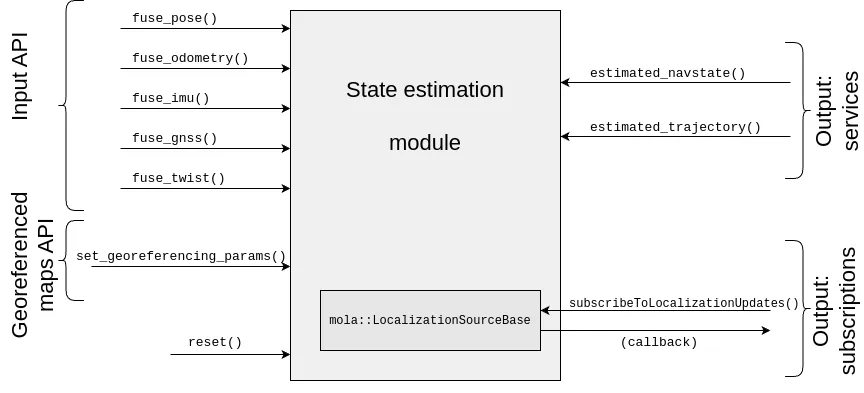

.. _mola_sta_est_index:

===================
State estimators
===================

____________________________________________

.. contents::
   :depth: 1
   :local:
   :backlinks: none

____________________________________________

|

1. Theory
---------------------------------
State Estimation (SE) comprises finding the **vehicle kinematic state(s)**
that **best explain** the imperfect, noisy **sensor readings**.

Write me!

What? Why? How?

|

2. Selecting the S.E. method in launch files
------------------------------------------------
In the context of launching LiDAR odometry (LO) mapping or localization
as explained :ref:`here <launching_mola_lo>`, note that default configurations
include ``StateEstimationSimple`` as the method of choice, but it can be 
changed as follows:

.. dropdown:: MOLA-LO with a custom State Estimation configuration
   :icon: code-review

   Both, all MOLA-LO GUI applications, and the ROS node, rely on MOLA system :ref:`configuration files <yaml_slam_cfg_file>`
   to know what MOLA modules to launch and what parameters to pass to them.

   - `Read through those files <https://github.com/MOLAorg/mola_lidar_odometry/tree/develop/mola-cli-launchs>`_
     to fully understand what is under the hood.
   - Default parameter files for estimators are provided under `mola_lidar_odometry/state-estimator-params <https://github.com/MOLAorg/mola_lidar_odometry/tree/develop/state-estimator-params>`_.

   So, what follows are just examples that should be considered starting points for user customizations by using custom S.E. parameter files:

   .. tab-set::

      .. tab-item:: Defaults
         :selected:

         .. code-block:: bash

            # Launch LO-GUI on the KITTI dataset, using the default state estimator:
            mola-lo-gui-kitti 04

            # Launch MOLA-LO (CLI version) on KITTI, using default state estimator:
            mola-lidar-odometry-cli \
              -c $(ros2 pkg prefix mola_lidar_odometry)/share/mola_lidar_odometry/pipelines/lidar3d-default.yaml \
              --input-kitti-seq 04

      .. tab-item:: Custom state estimator configuration

         .. code-block:: bash

            # Launch LO-GUI on the KITTI dataset, using the smoother state estimator:
            MOLA_STATE_ESTIMATOR="mola::state_estimation_smoother::StateEstimationSmoother" \
            MOLA_STATE_ESTIMATOR_YAML="$(ros2 pkg prefix mola_lidar_odometry)/share/mola_lidar_odometry/state-estimator-params/state-estimation-smoother.yaml" \
              mola-lo-gui-kitti 04

            # Launch MOLA-LO (CLI version) on KITTI, using the smoother state estimator:
            mola-lidar-odometry-cli \
              -c $(ros2 pkg prefix mola_lidar_odometry)/share/mola_lidar_odometry/pipelines/lidar3d-default.yaml \
              --state-estimator "mola::state_estimation_smoother::StateEstimationSmoother" \
              --load-plugins libmola_state_estimation_smoother.so \
              --input-kitti-seq 04

            # idem, using non-default state-estimation parameters:
            mola-lidar-odometry-cli \
              -c $(ros2 pkg prefix mola_lidar_odometry)/share/mola_lidar_odometry/pipelines/lidar3d-default.yaml \
              --state-estimator "mola::state_estimation_smoother::StateEstimationSmoother" \
              --state-estimator-param-file $(ros2 pkg prefix mola_lidar_odometry)/share/mola_lidar_odometry/state-estimator-params/state-estimation-smoother.yaml \
              --load-plugins libmola_state_estimation_smoother.so \
              --input-kitti-seq 04

|

3. API and supported inputs
---------------------------------
Write me!

|

4. Implementation: Simple estimator
---------------------------------------
Write me!

|

5. Implementation: Factor graph smoother
------------------------------------------
The package ``mola_state_estimation_smoother`` implements a sliding window optimization over the
last few keyframes and sensor observations (odometry sources, IMU, GNNS) in order to being able to solve
for the optimal kinematic state (pose + velocity) at any desired time point, interpolating or extrapolating
into the past or future.

When run as a MOLA module (e.g. within a ROS 2 node), it also publishes the estimated fused pose information
in a timely manner, for use as the high-quality, robust localization source.

This package follows this frame convention (see :ref:`other /tf configurations <mola_ros2_tf_frames>` when using
MOLA LiDAR-odometry without state estimation):

.. figure:: https://mrpt.github.io/imgs/mola_mrpt_ros_frames_fusion.png
    :width: 500
    :align: center

This is who is responsible of publishing each transformation:

- ``odom_{i} → base_link``: One or more odometry sources.
- ``map → base_link``: Published by **this state estimation package**.
- ``enu → {map, utm}``: Published by ``mrpt_map_server`` (`github <https://github.com/mrpt-ros-pkg/mrpt_navigation/tree/ros2/mrpt_map_server/>`_)
  or ``mola_lidar_odometry`` :ref:`map loading service <map_loading_saving>` if fed with a geo-referenced metric map (``.mm``) file.

Add me: Pictures of factor graph model.

Write me: concept of adding temporary keyframes for querying the pose at a given time.

5.1. Kinematic factors
~~~~~~~~~~~~~~~~~~~~~~~~~~~~~~~~~~~~~~~~~~~~
Between two consecutive keyframes close enough in time, a "kinematic factor" is added.
Two options are implemented:

A. Free motion kinematic factor
^^^^^^^^^^^^^^^^^^^^^^^^^^^^^^^^^^^
This is actually implemented as the combination of distinct GTSAM factors:

- ``mola::state_estimation_smoother::FactorConstLocalVelocity``: between linear and the angular velocity components of both keyframes to
  favor smooth velocities. See line 3 of eq (4) in the MOLA RSS2019 paper.
- ``mola::state_estimation_smoother::FactorTrapezoidalIntegrator``: enforces fulfillment of numerical integration on the translational
  part of SE(3). See line 2 of eq (1) in the MOLA RSS2019 paper.
- ``mola::state_estimation_smoother::FactorAngularVelocityIntegration``: enforces the fulfillment of numerical integration on the rotational
  part of SE(3). See line 1 of eq (4) in the MOLA RSS2019 paper.

B. Tricycle model kinematic factor
^^^^^^^^^^^^^^^^^^^^^^^^^^^^^^^^^^^
This is actually implemented as the combination of distinct GTSAM factors:

- ``mola::state_estimation_smoother::FactorConstLocalVelocity``: between linear and the angular velocity components of both keyframes to
  favor smooth velocities. See line 3 of eq (4) in the MOLA RSS2019 paper.
- ``mola::state_estimation_smoother::FactorTricycleModelIntegrator``: enforces fulfillment of numerical integration assuming the robot moves
  following the part of SE(3). TODO: Write equations!
- ``gtsam::PriorFactor``: to (gently) favor null components of the local velocity components ``vy``, ``vz``, ``wx``, ``wy``. Parameters can be
  used to tune how much these soft constraints are allowed to be broken, i.e. depending on how much wheel slippage exists.

|