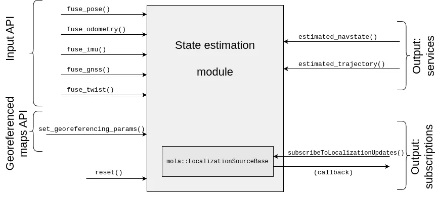

.. _mola_sta_est_index:

===================
State estimators
===================

____________________________________________

.. contents::
   :depth: 1
   :local:
   :backlinks: none

____________________________________________

|

1. Theory
---------------------------------
State Estimation (SE) comprises finding the **vehicle kinematic state(s)**
that **best explain** the imperfect, noisy **sensor readings**.

Write me!

What? Why? How?

|

2. Selecting the S.E. method in launch files
------------------------------------------------

2.1. Launching the state estimator standalone
~~~~~~~~~~~~~~~~~~~~~~~~~~~~~~~~~~~~~~~~~~~~~~~~

Next we show different possible use cases.

.. dropdown:: Merging wheel odometry + GNSS + IMU
   :icon: code-review

    .. code-block:: bash

      # MOLA_VERBOSITY_BRIDGE_ROS2=DEBUG \
      # MOLA_VERBOSITY_MOLA_STATE_ESTIMATOR=DEBUG \

      ros2 launch mola_state_estimation_smoother ros2-state-estimator.launch.py \
        estimate_geo_reference:=True \
        odom1_topic:=/wheel_odom \
        imu_topic_name:=/imu \
        gnss_topic_name:=/gps1

   Up to three ``nav_msgs/Odometry`` sources can be fused simultaneously via
   ``odom1_topic``, ``odom2_topic``, and ``odom3_topic`` (empty string disables
   each one). Without at least one odometry source the smoother relies solely on
   the constant-velocity kinematic model between GNSS fixes, which degrades for
   non-smooth motion.

.. dropdown:: Fusing two ``nav_msgs/Odometry`` sources (e.g. wheel + visual odometry)
   :icon: code-review

   This demo subscribes to two ``nav_msgs/Odometry`` topics from ROS 2, fuses them
   in the sliding-window factor graph smoother alongside an optional IMU, and publishes
   the fused result back as ``nav_msgs/Odometry`` + ``/tf``.

   Each odometry topic is assigned a distinct ``output_sensor_label``; the smoother
   treats them as independent odometry frames and estimates the optimal
   ``T_map_to_odom_X`` transform for each one.

   **Step 1 — Start the fake sensor publisher (for testing without a real robot):**

   .. code-block:: bash

      # Wheel odom (50 Hz) + visual odom (30 Hz, Y drift) + IMU (100 Hz) —
      # all from a single script, circular motion at vx=1 m/s, wz=0.2 rad/s:
      python3 $(ros2 pkg prefix mola_demos)/share/mola_demos/demos/fake_sensor_publisher.py \
        --ros-args \
        -p scenario:=circle \
        -p odom2_topic:=/visual_odom \
        -p imu_topic:=/imu

   The two odometry streams share the same ground-truth circular motion but have
   different noise and drift characteristics so the smoother can demonstrate
   visible fusion benefit.  The script supports three scenarios via ``scenario:=``
   (``circle``, ``moving``, ``static``) and can also publish GNSS by setting
   ``gnss_topic:=/gps``.

   **Step 2 — Launch the smoother:**

   .. code-block:: bash

      ros2 launch mola_state_estimation_smoother ros2-fuse-two-odometries.launch.py \
        odom1_topic:=/wheel_odom \
        odom2_topic:=/visual_odom \
        imu_topic:=/imu

   Or using ``mola-cli`` directly (set topic names via environment variables):

   .. code-block:: bash

      ODOM1_TOPIC=/wheel_odom \
      ODOM2_TOPIC=/visual_odom \
      IMU_TOPIC=/imu \
        mola-cli $(ros2 pkg prefix mola_state_estimation_smoother)/share/mola_state_estimation_smoother/mola-cli-launchs/state_estimator_ros2.yaml

   Key launch arguments:

   .. list-table::
      :header-rows: 1
      :widths: 30 15 55

      * - Argument
        - Default
        - Description
      * - ``odom1_topic``
        - ``/wheel_odom``
        - First ``nav_msgs/Odometry`` topic (e.g. wheel encoders)
      * - ``odom2_topic``
        - ``/visual_odom``
        - Second ``nav_msgs/Odometry`` topic (e.g. visual/LiDAR odometry)
      * - ``imu_topic``
        - ``/imu``
        - IMU topic for gravity alignment
      * - ``gnss_topic``
        - ``/gps``
        - Optional GNSS topic for geo-referencing
      * - ``enforce_planar_motion``
        - ``False``
        - Constrain z=0, pitch=0, roll=0 for ground vehicles
      * - ``use_mola_gui``
        - ``True``
        - Show MolaViz visualization

   **Step 3 — Verify fused output:**

   .. code-block:: bash

      # Fused pose as nav_msgs/Odometry:
      ros2 topic echo /state_estimation/pose

      # Inspect all published topics:
      ros2 topic list | grep state_estimation

      # View /tf tree:
      ros2 run tf2_tools view_frames

.. dropdown:: LiDAR odometry + wheel odometry fused in the smoother
   :icon: code-review

   This demo runs ``mola::LidarOdometry`` from a live ``PointCloud2`` topic alongside
   an external wheel odometry source from ROS 2. Both are fused by
   ``StateEstimationSmoother``, and the fused result is published back to ROS 2.

   Data flow::

     ROS2 /lidar_points  --> BridgeROS2 --> LidarOdometry ---+
     ROS2 /wheel_odom    --> BridgeROS2 ----+                |
     ROS2 /imu           --> BridgeROS2 ----+--> StateEstimationSmoother
                                                      |
                                             advertiseUpdatedLocalization()
                                                      |
                                               BridgeROS2 --> /state_estimation/pose
                                                          --> /tf (map -> base_link)

   .. code-block:: bash

      ros2 launch mola_lidar_odometry ros2-lidar-odometry.launch.py \
        lidar_topic_name:=/ouster/points \
        use_state_estimator:=True \
        forward_ros_tf_odom_to_mola:=False

   To additionally subscribe to a wheel odometry topic, use the ``mola-cli`` YAML directly:

   .. code-block:: bash

      WHEEL_ODOM_TOPIC=/wheel_odom \
      MOLA_LIDAR_TOPIC=/ouster/points \
        mola-cli $(ros2 pkg prefix mola_state_estimation_smoother)/share/mola_state_estimation_smoother/mola-cli-launchs/demo_lidar_odom_plus_wheel_odom_fusion.yaml

|

2.2. Launching the state estimator + LO/LIO
~~~~~~~~~~~~~~~~~~~~~~~~~~~~~~~~~~~~~~~~~~~~~~~~
In the context of launching LiDAR odometry (LO) mapping or localization
as explained :ref:`here <launching_mola_lo>`, note that default configurations
include ``StateEstimationSimple`` as the method of choice, but it can be 
changed as follows:

.. dropdown:: MOLA-LO with a custom State Estimation configuration
   :icon: code-review

   Both, all MOLA-LO GUI applications, and the ROS node, rely on MOLA system :ref:`configuration files <yaml_slam_cfg_file>`
   to know what MOLA modules to launch and what parameters to pass to them.

   - `Read through those files <https://github.com/MOLAorg/mola_lidar_odometry/tree/develop/mola-cli-launchs>`_
     to fully understand what is under the hood.
   - Default parameter files for estimators are provided under `mola_lidar_odometry/state-estimator-params <https://github.com/MOLAorg/mola_lidar_odometry/tree/develop/state-estimator-params>`_.

   So, what follows are just examples that should be considered starting points for user customizations by using custom S.E. parameter files:

   .. tab-set::

      .. tab-item:: Defaults
         :selected:

         .. code-block:: bash

            # Launch LO-GUI on the KITTI dataset, using the default state estimator:
            mola-lo-gui-kitti 04

            # Launch MOLA-LO (CLI version) on KITTI, using default state estimator:
            mola-lidar-odometry-cli \
              -c $(ros2 pkg prefix mola_lidar_odometry)/share/mola_lidar_odometry/pipelines/lidar3d-default.yaml \
              --input-kitti-seq 04

      .. tab-item:: Custom state estimator configuration

         .. code-block:: bash

            # Launch LO-GUI on the KITTI dataset, using the smoother state estimator:
            MOLA_STATE_ESTIMATOR="mola::state_estimation_smoother::StateEstimationSmoother" \
            MOLA_STATE_ESTIMATOR_YAML="$(ros2 pkg prefix mola_lidar_odometry)/share/mola_lidar_odometry/state-estimator-params/state-estimation-smoother.yaml" \
              mola-lo-gui-kitti 04

            # Launch MOLA-LO (CLI version) on KITTI, using the smoother state estimator:
            mola-lidar-odometry-cli \
              -c $(ros2 pkg prefix mola_lidar_odometry)/share/mola_lidar_odometry/pipelines/lidar3d-default.yaml \
              --state-estimator "mola::state_estimation_smoother::StateEstimationSmoother" \
              --load-plugins libmola_state_estimation_smoother.so \
              --input-kitti-seq 04

            # idem, using non-default state-estimation parameters:
            mola-lidar-odometry-cli \
              -c $(ros2 pkg prefix mola_lidar_odometry)/share/mola_lidar_odometry/pipelines/lidar3d-default.yaml \
              --state-estimator "mola::state_estimation_smoother::StateEstimationSmoother" \
              --state-estimator-param-file $(ros2 pkg prefix mola_lidar_odometry)/share/mola_lidar_odometry/state-estimator-params/state-estimation-smoother.yaml \
              --load-plugins libmola_state_estimation_smoother.so \
              --input-kitti-seq 04

|

3. API and supported inputs
---------------------------------
Write me!

|

4. Implementation: Simple estimator
---------------------------------------
Write me!

|

5. Implementation: Factor graph smoother
------------------------------------------
The package ``mola_state_estimation_smoother`` implements a sliding window optimization over the
last few keyframes and sensor observations (odometry sources, IMU, GNNS) in order to being able to solve
for the optimal kinematic state (pose + velocity) at any desired time point, interpolating or extrapolating
into the past or future.

When run as a MOLA module (e.g. within a ROS 2 node), it also publishes the estimated fused pose information
in a timely manner, for use as the high-quality, robust localization source.

This package follows this frame convention (see :ref:`other /tf configurations <mola_ros2_tf_frames>` when using
MOLA LiDAR-odometry without state estimation):

.. figure:: https://mrpt.github.io/imgs/mola_mrpt_ros_frames_fusion.png
    :width: 500
    :align: center

This is who is responsible of publishing each transformation:

- ``odom_{i} → base_link``: One or more odometry sources.
- ``map → base_link``: Published by **this state estimation package** (``mola_state_estimation_smoother``).
- ``enu → {map, utm}``: Published by either:

  - ``mola_lidar_odometry`` :ref:`map loading service <map_loading_saving>` if fed with a geo-referenced metric map (``.mm``) file; or
  - ``mola_state_estimation_smoother`` (this package) if geo-referencing is to be estimated at run-time; or
  - ``mrpt_map_server`` (`github <https://github.com/mrpt-ros-pkg/mrpt_navigation/tree/ros2/mrpt_map_server/>`_) if set to publish a geo-referenced
    map.

Add me: Pictures of factor graph model.

Write me: concept of adding temporary keyframes for querying the pose at a given time.

5.1. Kinematic factors
~~~~~~~~~~~~~~~~~~~~~~~~~~~~~~~~~~~~~~~~~~~~
Between two consecutive keyframes close enough in time, a "kinematic factor" is added.
Two options are implemented:

A. Free motion kinematic factor
^^^^^^^^^^^^^^^^^^^^^^^^^^^^^^^^^^^
This is actually implemented as the combination of distinct GTSAM factors:

- ``mola::state_estimation_smoother::FactorConstLocalVelocityPose``: between linear and the angular velocity components of both keyframes to
  favor smooth velocities. See line 3 of eq (4) in the MOLA RSS2019 paper.
- ``mola::state_estimation_smoother::FactorTrapezoidalIntegrator``: enforces fulfillment of numerical integration on the translational
  part of SE(3). See line 2 of eq (1) in the MOLA RSS2019 paper.
- ``mola::state_estimation_smoother::FactorAngularVelocityIntegration``: enforces the fulfillment of numerical integration on the rotational
  part of SE(3). See line 1 of eq (4) in the MOLA RSS2019 paper.

B. Tricycle model kinematic factor
^^^^^^^^^^^^^^^^^^^^^^^^^^^^^^^^^^^
This is actually implemented as the combination of distinct GTSAM factors:

- ``mola::state_estimation_smoother::FactorConstLocalVelocityPose``: between linear and the angular velocity components of both keyframes to
  favor smooth velocities. See line 3 of eq (4) in the MOLA RSS2019 paper.
- ``mola::state_estimation_smoother::FactorTricycleModelIntegrator``: enforces fulfillment of numerical integration assuming the robot moves
  following the part of SE(3). TODO: Write equations!
- ``gtsam::PriorFactor``: to (gently) favor null components of the local velocity components ``vy``, ``vz``, ``wx``, ``wy``. Parameters can be
  used to tune how much these soft constraints are allowed to be broken, i.e. depending on how much wheel slippage exists.

|