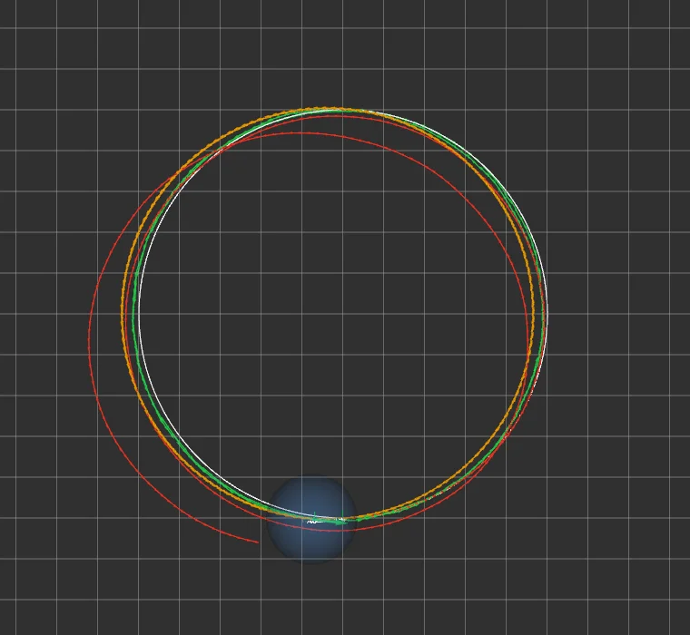
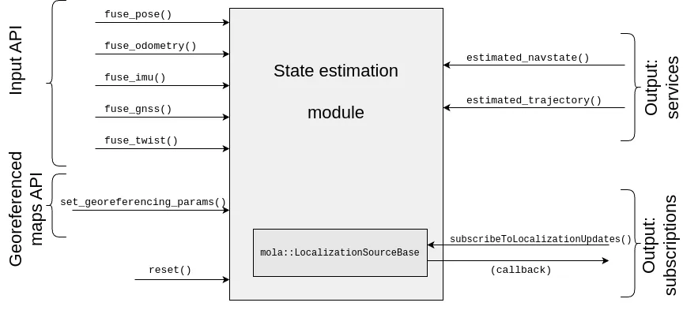

.. _mola_sta_est_index:

===================
State estimators
===================

.. contents::
   :depth: 1
   :local:
   :backlinks: none

____________________________________________

|

1. Theory
---------------------------------
State Estimation (SE) comprises finding the **vehicle kinematic state(s)**
that **best explain** the imperfect, noisy **sensor readings**.

**What?** In MOLA, the kinematic state of the vehicle at time :math:`t` is

.. math::

   \mathbf{x}(t) = \left( \mathbf{T}(t),\ \mathbf{v}(t),\ \boldsymbol{\omega}(t) \right)

where :math:`\mathbf{T}(t) \in SE(3)` is the pose of the vehicle (``base_link``) in a
reference frame (typically ``map``), and :math:`\mathbf{v}(t), \boldsymbol{\omega}(t)`
are its linear and angular velocity expressed in the vehicle's own frame (the *body twist*).
A state estimator answers *"what is* :math:`\mathbf{x}(t)` *and how uncertain is it?"*
for any time :math:`t` close to the latest measurements, in any of the frames it knows about.

**Why?**

- No single sensor is enough: wheel, visual and LiDAR odometry drift over time; GNSS is
  absolute but noisy, slow, and sometimes unavailable; an IMU gives attitude and rates,
  but positions integrated from it drift within seconds.
- Sensors run at different rates and with different latencies, while consumers need the
  state at *their own* timestamps: LiDAR odometry needs a motion prior at each scan time
  (ICP initial guess, scan de-skewing), a controller needs a smooth, high-rate pose.
- Each estimate comes with a covariance, so it can be used as a properly weighted prior
  by other modules.

**How?** By default, both estimators share a *constant velocity* motion model between
measurements (``StateEstimationSimple`` can optionally integrate the IMU instead, see
``imu_propagation`` in :ref:`section 4 <mola_sta_est_simple>`):

.. math::

   \mathbf{T}(t + \Delta t) = \mathbf{T}(t) \oplus \exp\!\left(
   \begin{bmatrix} \mathbf{v}(t) \\ \boldsymbol{\omega}(t) \end{bmatrix} \Delta t \right)

where unmodeled accelerations are treated as zero-mean white noise
(parameters ``sigma_random_walk_acceleration_linear`` and ``_angular``), so uncertainty grows
with :math:`\Delta t`. This model is used to interpolate or extrapolate the state to any requested
time. Requests farther than ``max_time_to_use_velocity_model`` from the latest data return no
estimate.

The two implementations differ in how measurements are combined:

- ``StateEstimationSimple`` (:ref:`section 4 <mola_sta_est_simple>`) keeps only the latest
  state: each new pose replaces the previous one, and velocities are low-pass filtered.
  Cheap and robust, but it does not really *fuse* redundant sources.
- ``StateEstimationSmoother`` (:ref:`section 5 <mola_sta_est_smoother>`) solves a
  maximum a posteriori (MAP) problem over a sliding window of *keyframes*:

  .. math::

     \mathcal{X}^\star = \arg\min_{\mathcal{X}} \sum_j \rho_j\!\left(
     \left\| \mathbf{r}_j(\mathcal{X}_j) \right\|^2_{\boldsymbol{\Sigma}_j} \right),
     \qquad
     \|\mathbf{r}\|^2_{\boldsymbol{\Sigma}} = \mathbf{r}^\top \boldsymbol{\Sigma}^{-1} \mathbf{r}

  The variables :math:`\mathcal{X}` are :math:`\mathbf{T}_k, \mathbf{v}_k, \boldsymbol{\omega}_k`
  for every keyframe :math:`k` in the last ``sliding_window_length`` seconds, plus the pose of
  each odometry frame in ``map`` (``T_map_to_odom_i``) and the geo-reference (``T_enu_to_map``).
  Each factor :math:`\mathbf{r}_j` is either a sensor measurement or a kinematic constraint between
  consecutive keyframes, with covariance :math:`\boldsymbol{\Sigma}_j`; :math:`\rho_j` is the
  identity (Gaussian noise) or a Huber kernel for robust factors.
  The problem is solved incrementally with iSAM2 (GTSAM), and keyframes leaving the window are
  marginalized out, so the cost per update stays bounded.
  Since all states within the window are re-estimated as new evidence arrives, the smoother can
  also estimate quantities only observable over time, such as the drift of each odometry frame
  with respect to ``map``, or the geo-reference.

|

2. Selecting the S.E. method in launch files
------------------------------------------------

.. _mola_sta_est_try_it:

2.1. Try it yourself: simulated sensors + RViz
~~~~~~~~~~~~~~~~~~~~~~~~~~~~~~~~~~~~~~~~~~~~~~~~~~
No robot or dataset is needed for a first look at the smoother. This demo runs a simulated
robot driving a circle of 5 m radius at 1 m/s, publishing noisy wheel odometry, drifting
visual odometry, IMU and GNSS, plus its ground truth. The smoother fuses the sensor
combination selected with ``mode``, and RViz shows the result:

.. code-block:: bash

   ros2 launch mola_state_estimation_smoother ros2-demo-simulated-sensors.launch.py \
     mode:=wheels_imu

   ``mode:=wheels_imu`` after one lap: ground truth (white), raw wheel odometry (red),
   raw visual odometry (orange, not fused in this mode), fused trail (green), and the
   current fused pose with its position covariance (blue).

.. list-table::
   :header-rows: 1
   :widths: 25 75

   * - ``mode``
     - Fused sensors, and what to look at
   * - ``wheels_imu`` (default)
     - Wheel odometry + IMU. The wheel odometry heading drifts; the IMU attitude keeps the
       fused heading, so the fused trail stays on the ground truth while the raw odometry
       spirals away. Position uncertainty grows, since nothing observes absolute position.
   * - ``wheels_imu_gnss``
     - Wheel odometry + IMU + GNSS, estimating the geo-reference (``enu -> map``) online.
       The ground truth, given in ``enu``, is only drawn once the geo-reference converges,
       and through that estimate, so it also shows its error.
   * - ``two_odometries``
     - Wheel odometry + drifting visual odometry + IMU: two odometry chains, each with its
       own ``T_map_to_odom_i``.
   * - ``imu_gnss``
     - IMU + GNSS only. Without odometry, the trajectory between GNSS fixes relies on the
       IMU and the constant velocity model alone; compare it with the other modes.

Other launch arguments: ``use_rviz`` (default ``True``), ``use_mola_gui`` (MolaViz console,
default ``False``), and the simulated noise ``wheel_odom_ang_sigma`` (yaw rate noise,
default ``0.15`` rad/s) and ``visual_odom_drift`` (lateral drift, default ``0.08`` m/s).
Smoother parameters can be overridden as explained in the next section, e.g. prefix the
command with ``MOLA_REL_POSE_INCR_SIGMA_LIN=0.05`` to see the effect of trusting each
odometry increment less.

Under the hood, this launch file runs the synthetic sensor publisher from ``mola_demos``
and includes ``ros2-state-estimator.launch.py``, the same one used with real sensors below.

2.2. Launching the state estimator standalone
~~~~~~~~~~~~~~~~~~~~~~~~~~~~~~~~~~~~~~~~~~~~~~~~

Next we show different possible use cases.
All of them run ``StateEstimationSmoother`` inside a ``mola-cli`` process, with
``mola::BridgeROS2`` subscribing to the sensor topics and publishing the fused result back
to ROS 2. See :ref:`section 3 <mola_sta_est_api>` for how each message type is fused.

Smoother parameters are read from
`params/state-estimation-smoother.yaml <https://github.com/MOLAorg/mola_state_estimation/blob/develop/mola_state_estimation_smoother/params/state-estimation-smoother.yaml>`_.
Most of them can be overridden via the environment variables named in that file, or a whole
custom copy of the file can be used instead:

.. code-block:: bash

   MOLA_STATE_ESTIMATOR_YAML=/path/to/my-smoother-params.yaml \
     ros2 launch mola_state_estimation_smoother ros2-state-estimator.launch.py [...]

.. dropdown:: Merging wheel odometry + GNSS + IMU
   :icon: code-review

    .. code-block:: bash

      # MOLA_VERBOSITY_BRIDGE_ROS2=DEBUG \
      # MOLA_VERBOSITY_MOLA_STATE_ESTIMATOR=DEBUG \

      ros2 launch mola_state_estimation_smoother ros2-state-estimator.launch.py \
        estimate_geo_reference:=True \
        odom1_topic:=/wheel_odom \
        imu_topic_name:=/imu \
        gnss_topic_name:=/gps1

   Up to three ``nav_msgs/Odometry`` sources can be fused simultaneously via
   ``odom1_topic``, ``odom2_topic``, and ``odom3_topic`` (empty string disables
   each one). Without at least one odometry source the smoother relies solely on
   the constant-velocity kinematic model between GNSS fixes, which degrades for
   non-smooth motion.

   The launch arguments ``navstate_kinematic_model``, ``navstate_sliding_window_sec``,
   ``navstate_sigma_random_walk_linacc`` and ``navstate_sigma_random_walk_angacc``
   are empty by default, meaning the value from the parameters YAML file is used.
   Set them to override it.

.. dropdown:: Fusing two ``nav_msgs/Odometry`` sources (e.g. wheel + visual odometry)
   :icon: code-review

   This demo subscribes to two ``nav_msgs/Odometry`` topics from ROS 2, fuses them
   in the sliding-window factor graph smoother alongside an optional IMU, and publishes
   the fused result back as ``nav_msgs/Odometry`` + ``/tf``.

   Each odometry topic is assigned a distinct ``output_sensor_label``; the smoother
   treats them as independent odometry frames and estimates the optimal
   ``T_map_to_odom_X`` transform for each one.

   **Step 1: Start the fake sensor publisher (for testing without a real robot):**

   .. code-block:: bash

      # Wheel odom (50 Hz) + visual odom (30 Hz, Y drift) + IMU (100 Hz),
      # all from a single script, circular motion at vx=1 m/s, wz=0.2 rad/s:
      python3 $(ros2 pkg prefix mola_demos)/share/mola_demos/demos/fake_sensor_publisher.py \
        --ros-args \
        -p scenario:=circle \
        -p odom2_topic:=/visual_odom \
        -p imu_topic:=/imu

   The two odometry streams share the same ground-truth circular motion but have
   different noise and drift characteristics so the smoother can demonstrate
   visible fusion benefit.  The script supports three scenarios via ``scenario:=``
   (``circle``, ``moving``, ``static``) and can also publish GNSS by setting
   ``gnss_topic:=/gps``.

   **Step 2: Launch the smoother:**

   .. code-block:: bash

      ros2 launch mola_state_estimation_smoother ros2-fuse-two-odometries.launch.py \
        odom1_topic:=/wheel_odom \
        odom2_topic:=/visual_odom \
        imu_topic_name:=/imu

   Or using ``mola-cli`` directly (set topic names via environment variables):

   .. code-block:: bash

      ODOM1_TOPIC=/wheel_odom \
      ODOM2_TOPIC=/visual_odom \
      IMU_TOPIC=/imu \
        mola-cli $(ros2 pkg prefix mola_state_estimation_smoother)/share/mola_state_estimation_smoother/mola-cli-launchs/state_estimator_ros2.yaml

   .. tip::

      Odometry sources are fused as chains of increments, whose uncertainty is set by
      ``relative_pose_increment_sigma_lin`` / ``_ang`` (env vars ``MOLA_REL_POSE_INCR_SIGMA_LIN``
      / ``_ANG``), not by the covariance in the messages. Tune them for each platform.
      See :ref:`section 3 <mola_sta_est_api>`.

   Key launch arguments:

   .. list-table::
      :header-rows: 1
      :widths: 30 15 55

      * - Argument
        - Default
        - Description
      * - ``odom1_topic``
        - ``/wheel_odom``
        - First ``nav_msgs/Odometry`` topic (e.g. wheel encoders)
      * - ``odom1_label``
        - ``wheel_odom``
        - Sensor label (and odometry frame name) of the first source
      * - ``odom2_topic``
        - ``/visual_odom``
        - Second ``nav_msgs/Odometry`` topic (e.g. visual/LiDAR odometry)
      * - ``odom2_label``
        - ``visual_odom``
        - Sensor label (and odometry frame name) of the second source
      * - ``imu_topic_name``
        - ``/imu``
        - IMU topic (empty to disable)
      * - ``gnss_topic_name``
        - (empty)
        - Optional GNSS ``NavSatFix`` topic (empty to disable)
      * - ``enforce_planar_motion``
        - ``False``
        - Constrain z=0, pitch=0, roll=0 for ground vehicles
      * - ``use_mola_gui``
        - ``True``
        - Show MolaViz visualization
      * - ``use_rviz``
        - ``False``
        - Also launch RViz2

   **Step 3: Verify fused output:**

   .. code-block:: bash

      # Fused pose as nav_msgs/Odometry:
      ros2 topic echo /state_estimation/pose

      # Inspect all published topics:
      ros2 topic list | grep state_estimation

      # View /tf tree:
      ros2 run tf2_tools view_frames

.. dropdown:: LiDAR odometry + wheel odometry fused in the smoother
   :icon: code-review

   This demo runs ``mola::LidarOdometry`` from a live ``PointCloud2`` topic alongside
   an external wheel odometry source from ROS 2. Both are fused by
   ``StateEstimationSmoother``, and the fused result is published back to ROS 2.

   Data flow::

     ROS2 /lidar_points  --> BridgeROS2 --> LidarOdometry ---+
     ROS2 /wheel_odom    --> BridgeROS2 ----+                |
     ROS2 /imu           --> BridgeROS2 ----+--> StateEstimationSmoother
                                                      |
                                             advertiseUpdatedLocalization()
                                                      |
                                               BridgeROS2 --> /state_estimation/pose
                                                          --> /tf (map -> base_link)

   .. code-block:: bash

      ros2 launch mola_lidar_odometry ros2-lidar-odometry.launch.py \
        lidar_topic_name:=/ouster/points \
        use_state_estimator:=True \
        forward_ros_tf_odom_to_mola:=False

   To additionally subscribe to a wheel odometry topic, use the ``mola-cli`` YAML directly
   (``GNSS_TOPIC`` is optional, and smoother parameters come from the same YAML file as above):

   .. code-block:: bash

      WHEEL_ODOM_TOPIC=/wheel_odom \
      MOLA_LIDAR_TOPIC=/ouster/points \
        mola-cli $(ros2 pkg prefix mola_state_estimation_smoother)/share/mola_state_estimation_smoother/mola-cli-launchs/demo_lidar_odom_plus_wheel_odom_fusion.yaml

|

2.3. Launching the state estimator + LO/LIO
~~~~~~~~~~~~~~~~~~~~~~~~~~~~~~~~~~~~~~~~~~~~~~~~
In the context of launching LiDAR odometry (LO) mapping or localization
as explained :ref:`here <launching_mola_lo>`, note that default configurations
include ``StateEstimationSimple`` as the method of choice, but it can be
changed as follows:

.. dropdown:: MOLA-LO with a custom State Estimation configuration
   :icon: code-review

   Both, all MOLA-LO GUI applications, and the ROS node, rely on MOLA system :ref:`configuration files <yaml_slam_cfg_file>`
   to know what MOLA modules to launch and what parameters to pass to them.

   - `Read through those files <https://github.com/MOLAorg/mola_lidar_odometry/tree/develop/mola-cli-launchs>`_
     to fully understand what is under the hood.
   - Default parameter files for estimators:
     `state-estimation-simple.yaml <https://github.com/MOLAorg/mola_lidar_odometry/tree/develop/state-estimator-params>`_
     (in ``mola_lidar_odometry``) and
     `state-estimation-smoother.yaml <https://github.com/MOLAorg/mola_state_estimation/blob/develop/mola_state_estimation_smoother/params/state-estimation-smoother.yaml>`_
     (in ``mola_state_estimation_smoother``).

   So, what follows are just examples that should be considered starting points for user customizations by using custom S.E. parameter files:

   .. tab-set::

      .. tab-item:: Defaults
         :selected:

         .. code-block:: bash

            # Launch LO-GUI on the KITTI dataset, using the default state estimator:
            mola-lo-gui-kitti 04

            # Launch MOLA-LO (CLI version) on KITTI, using default state estimator:
            mola-lidar-odometry-cli \
              -c $(ros2 pkg prefix mola_lidar_odometry)/share/mola_lidar_odometry/pipelines/lidar3d-default.yaml \
              --input-kitti-seq 04

      .. tab-item:: Custom state estimator configuration

         .. code-block:: bash

            # Launch LO-GUI on the KITTI dataset, using the smoother state estimator:
            MOLA_STATE_ESTIMATOR="mola::state_estimation_smoother::StateEstimationSmoother" \
            MOLA_STATE_ESTIMATOR_YAML="$(ros2 pkg prefix mola_state_estimation_smoother)/share/mola_state_estimation_smoother/params/state-estimation-smoother.yaml" \
              mola-lo-gui-kitti 04

            # Launch MOLA-LO (CLI version) on KITTI, using the smoother state estimator:
            mola-lidar-odometry-cli \
              -c $(ros2 pkg prefix mola_lidar_odometry)/share/mola_lidar_odometry/pipelines/lidar3d-default.yaml \
              --state-estimator "mola::state_estimation_smoother::StateEstimationSmoother" \
              --load-plugins libmola_state_estimation_smoother.so \
              --input-kitti-seq 04

            # idem, using the smoother parameter file. MOLA_ASYNC_BACKEND=false
            # selects the deterministic (synchronous) solver, best for offline runs:
            MOLA_ASYNC_BACKEND=false \
            mola-lidar-odometry-cli \
              -c $(ros2 pkg prefix mola_lidar_odometry)/share/mola_lidar_odometry/pipelines/lidar3d-default.yaml \
              --state-estimator "mola::state_estimation_smoother::StateEstimationSmoother" \
              --state-estimator-param-file $(ros2 pkg prefix mola_state_estimation_smoother)/share/mola_state_estimation_smoother/params/state-estimation-smoother.yaml \
              --load-plugins libmola_state_estimation_smoother.so \
              --input-kitti-seq 04

|

.. _mola_sta_est_api:

3. API and supported inputs
---------------------------------

3.1. C++ API
~~~~~~~~~~~~~~~~
Both estimators implement the virtual interface
:ref:`mola::NavStateFilter <doxid-classmola_1_1_nav_state_filter>`:

.. list-table::
   :header-rows: 1
   :widths: 35 65

   * - Method
     - Purpose
   * - ``fuse_pose(t, pose, frame_id)``
     - SE(3) pose with covariance of the vehicle at time ``t``, relative to frame ``frame_id``
       (``map``, or a source's own odometry frame).
   * - ``fuse_odometry(obs, name)``
     - Planar wheel odometry (``CObservationOdometry``); increment uncertainty comes from a
       motion model.
   * - ``fuse_imu(obs)``
     - IMU reading (``CObservationIMU``): orientation, acceleration and/or angular velocity.
   * - ``fuse_gnss(obs)``
     - GNSS fix (``CObservationGPS``).
   * - ``fuse_twist(t, twist, cov)``
     - Body velocity measurement.
   * - ``estimated_navstate(t, frame_id)``
     - Returns a :ref:`mola::NavState <doxid-structmola_1_1_nav_state>`: pose with its
       information matrix in ``frame_id``, plus body twist with its information matrix.
       Empty if there is not enough data yet, or ``t`` is too far from the latest data.

Optional methods: ``estimated_trajectory()``, ``has_converged_localization()``,
``set_geo_reference()`` / ``get_geo_reference()``.

When running as a MOLA module (e.g. inside ``mola-cli``), an estimator:

- receives raw observations from the module(s) named in its ``raw_data_source`` (e.g. ``BridgeROS2``,
  or a dataset source), and dispatches them by type as in the table below. Sensor labels are
  filtered with the regular expressions ``do_process_imu_labels_re``,
  ``do_process_odometry_labels_re`` and ``do_process_gnss_labels_re``. Observations labeled
  ``ground_truth`` are ignored unless ``fuse_ground_truth_label: true``.
- receives ``fuse_pose()`` calls and ``estimated_navstate()`` queries from other modules.
  For example, ``mola::LidarOdometry`` finds the estimator module in the system, feeds it
  its ICP poses, and uses its predictions as motion prior.

3.2. Inputs from ROS 2
~~~~~~~~~~~~~~~~~~~~~~~~~~
``mola::BridgeROS2`` converts subscribed topics into MOLA observations, labeled with each
topic's ``output_sensor_label``. IMU and GNSS observations carry the sensor pose on the vehicle,
taken from ``/tf`` (or from ``fixed_sensor_pose`` if ``use_fixed_sensor_pose: true``).

.. list-table::
   :header-rows: 1
   :widths: 18 41 41

   * - ROS 2 message
     - ``StateEstimationSmoother``
     - ``StateEstimationSimple``
   * - ``nav_msgs/Odometry``
       (default: becomes a ``CObservationRobotPose``)
     - ``fuse_pose()`` in the source's own frame (named after its label). Odometry drifts,
       so only the increments between consecutive keyframes are fused, with the uncertainty
       set by the required parameters ``relative_pose_increment_sigma_lin`` / ``_ang``
       (plus optional growth with the increment size, ``..._per_sqrt_meter`` / ``_rad``).
       The first reading adds one absolute factor, with the message covariance, to resolve
       ``T_map_to_odom_<label>``. The twist part is not used.
     - Increments between consecutive readings dead-reckon the pose between primary pose
       updates.
   * - ``nav_msgs/Odometry``
       (with ``BridgeROS2`` param ``odometry_as_robot_pose_observation: false``:
       becomes a planar ``CObservationOdometry``)
     - ``fuse_odometry()``: relative increments, with covariance from the motion model
       ``odom_motion_model_a1`` .. ``a4``.
     - Increments as above, plus wheel velocities (``sigma_wheel_odom_*``).
   * - ``sensor_msgs/Imu``
     - Orientation as an absolute attitude factor (``imu_attitude_sigma_deg``,
       ``imu_attitude_azimuth_offset_deg``); acceleration as gravity direction
       (``imu_normalized_gravity_alignment_sigma``, 0 disables); angular velocity as a prior
       on :math:`\boldsymbol{\omega}_k` (``imu_angular_velocity_sigma``, 0 disables).
       Readings are averaged over ``imu_min_sample_period``.
     - Angular velocity (``sigma_imu_angular_velocity``). Optionally, inertial propagation
       between pose updates (``imu_propagation``).
   * - ``sensor_msgs/NavSatFix``, ``gps_msgs/GPSFix``
     - ENU position factor with a Huber kernel (``gnss_huber_threshold``). Requires a geo-reference:
       either estimated (``estimate_geo_reference: true``) or fixed (``fixed_geo_reference``,
       or given by a geo-referenced map).
     - Ignored unless ``gnss_enabled: true`` and a geo-reference is set; then low-sigma fixes
       nudge the position.
   * - (none: C++ or other MOLA modules, e.g. LiDAR odometry)
     - ``fuse_pose()`` with ``frame_id`` equal to ``reference_frame_name`` (``map``): a prior
       factor on the keyframe pose. Other frames: as for ``nav_msgs/Odometry`` above.
     - Each pose becomes the new state; velocity is estimated from consecutive poses.

.. note::

   **IMU orientation.** ``sensor_msgs/Imu`` orientation is used unless
   ``orientation_covariance[0]`` is negative (the ROS convention for "no orientation").
   An IMU without magnetometer, whose yaw is arbitrary, must publish ``-1`` there, otherwise
   that yaw is taken as the absolute heading. By default (offset 0), yaw zero is assumed to point
   North; IMUs whose yaw zero points East (ENU, as in REP-103) need
   ``imu_attitude_azimuth_offset_deg: -90``.

3.3. Outputs
~~~~~~~~~~~~~~
- ``estimated_navstate()`` from C++, for any time and frame (see above).
- ``StateEstimationSmoother`` also publishes, at its module ``execution_rate``, the fused pose
  of ``vehicle_frame_name`` (``base_link``) in ``reference_frame_name`` (``map``).
  ``BridgeROS2`` forwards it as ``nav_msgs/Odometry`` on ``<module name>/pose``
  (e.g. ``/state_estimation/pose``) and as ``/tf``, if its
  ``publish_*_from_slam_source`` parameters select this module.
  Optional extra outputs: ``map -> odom`` (``publish_map_to_odom_tf``) and the fused pose in a
  separate child frame (``publish_fused_vehicle_tf``). An estimated geo-reference is published once
  converged (``publish_estimated_georef_on_convergence``).
- ``StateEstimationSimple`` does not publish anything by itself: it serves predictions to
  other modules, e.g. LiDAR odometry, which publishes its own pose.

|

.. _mola_sta_est_simple:

4. Implementation: Simple estimator
---------------------------------------
The package ``mola_state_estimation_simple`` implements
:ref:`StateEstimationSimple <doxid-classmola_1_1state__estimation__simple_1_1_state_estimation_simple>`,
a lightweight constant-velocity estimator. It is the default in MOLA LiDAR odometry, since
for LO/LIO the LiDAR poses dominate and all it needs is a good motion prior for the next scan.

Algorithm:

- **State:** the latest pose (with covariance) at its timestamp, plus the body twist
  :math:`(\mathbf{v}, \boldsymbol{\omega})`.
- **Pose updates** (``fuse_pose()``, e.g. LiDAR odometry) replace the pose. The twist is
  derived from consecutive poses of the same source (pose increment divided by :math:`\Delta t`).
- **Odometry** readings dead-reckon the pose forward between pose updates. Planar wheel odometry
  is applied in the yaw-only frame, and its velocities (if present) update the twist.
- **IMU** angular velocity updates :math:`\boldsymbol{\omega}`. IMU and odometry readings are
  buffered and applied in timestamp order, so results do not depend on delivery order.
- **Velocity filter** (``velocity_filter_enabled``, default on): each twist component is
  smoothed by a scalar Kalman filter, with process noise from
  ``sigma_random_walk_acceleration_*`` and measurement noise from each input.
- **Prediction:** ``estimated_navstate(t)`` applies the constant velocity model from the last pose
  (or integrates the IMU, if ``imu_propagation`` is enabled), with a diagonal covariance growing
  with :math:`\Delta t` since the last pose update:

  .. math::

     \sigma^2_{xyz} = \sigma^2_{v}\,\Delta t^2 + \left(\tfrac{1}{2}\sigma_{a,\text{lin}}\,\Delta t^2\right)^2
     + \sigma^2_{\text{rel,lin}},
     \qquad
     \sigma^2_{rot} = \sigma^2_{\omega}\,\Delta t^2 + \left(\tfrac{1}{2}\sigma_{a,\text{ang}}\,\Delta t^2\right)^2
     + \sigma^2_{\text{rel,ang}}

  (added to the last pose covariance), where :math:`\sigma_v, \sigma_\omega` are the
  uncertainties of the filtered twist, ``sigma_random_walk_acceleration_linear/angular``
  (:math:`\sigma_a`) model unmodeled accelerations, and ``sigma_relative_pose_linear/angular``
  (:math:`\sigma_{\text{rel}}`) is a constant floor. The linear velocity covariance is rotated
  from the vehicle frame into the map frame.
- The ``frame_id`` argument is ignored: all poses are assumed to be in the same frame.

Main parameters (default values from
`state-estimation-simple.yaml <https://github.com/MOLAorg/mola_lidar_odometry/tree/develop/state-estimator-params>`_;
the full list is in :ref:`Parameters <doxid-classmola_1_1state__estimation__simple_1_1_parameters>`):

.. list-table::
   :header-rows: 1
   :widths: 40 15 45

   * - Parameter
     - Default
     - Meaning
   * - ``max_time_to_use_velocity_model``
     - 0.75 s
     - Maximum extrapolation time since the last observation.
   * - ``sigma_random_walk_acceleration_linear`` / ``_angular``
     - 1.0 m/s², 10.0 rad/s²
     - Unmodeled acceleration; velocity filter process noise.
   * - ``sigma_relative_pose_linear`` / ``_angular``
     - 0.5 m, 0.1 rad
     - Constant floor of the predicted pose uncertainty (tightness of the ICP prior).
   * - ``sigma_imu_angular_velocity``
     - 0.05 rad/s
     - Gyroscope noise.
   * - ``sigma_wheel_odom_linear_vel`` / ``_angular_vel``
     - 0.1 m/s, 0.05 rad/s
     - Wheel odometry velocity noise.
   * - ``initial_twist`` (+ ``initial_twist_sigma_lin/ang``)
     - zero (20 m/s, 3 rad/s)
     - Initial velocity guess, e.g. for datasets starting in motion.
   * - ``imu_propagation``
     - false
     - Propagate the pose between updates by integrating the IMU (gyro + accelerometer) instead
       of a constant twist.
   * - ``gnss_enabled``
     - false
     - Use low-sigma GNSS fixes (e.g. RTK) to correct position drift, given a geo-reference.
   * - ``enforce_planar_motion``
     - false
     - Force z, pitch and roll to zero.

Use the smoother instead when several sources must be truly fused, or when GNSS-based
geo-referencing must be estimated.

|

.. _mola_sta_est_smoother:

5. Implementation: Factor graph smoother
------------------------------------------
The package ``mola_state_estimation_smoother`` implements a sliding window optimization over the
last few keyframes and sensor observations (odometry sources, IMU, GNNS) in order to being able to solve
for the optimal kinematic state (pose + velocity) at any desired time point, interpolating or extrapolating
into the past or future.

When run as a MOLA module (e.g. within a ROS 2 node), it also publishes the estimated fused pose information
in a timely manner, for use as the high-quality, robust localization source.

This package follows this frame convention (see :ref:`other /tf configurations <mola_ros2_tf_frames>` when using
MOLA LiDAR-odometry without state estimation):

.. figure:: https://mrpt.github.io/imgs/mola_mrpt_ros_frames_fusion.png
    :width: 500
    :align: center

This is who is responsible of publishing each transformation:

- ``odom_{i} → base_link``: One or more odometry sources.
- ``map → base_link``: Published by **this state estimation package** (``mola_state_estimation_smoother``).
- ``enu → {map, utm}``: Published by either:

  - ``mola_lidar_odometry`` :ref:`map loading service <map_loading_saving>` if fed with a geo-referenced metric map (``.mm``) file; or
  - ``mola_state_estimation_smoother`` (this package) if geo-referencing is to be estimated at run-time; or
  - ``mrpt_map_server`` (`github <https://github.com/mrpt-ros-pkg/mrpt_navigation/tree/ros2/mrpt_map_server/>`_) if set to publish a geo-referenced
    map.

Add me: Pictures of factor graph model.

Write me: concept of adding temporary keyframes for querying the pose at a given time.

5.1. Kinematic factors
~~~~~~~~~~~~~~~~~~~~~~~~~~~~~~~~~~~~~~~~~~~~
Between two consecutive keyframes close enough in time, a "kinematic factor" is added.
Two options are implemented:

A. Free motion kinematic factor
^^^^^^^^^^^^^^^^^^^^^^^^^^^^^^^^^^^
This is actually implemented as the combination of distinct GTSAM factors:

- ``mola::state_estimation_smoother::FactorConstLocalVelocityPose``: between linear and the angular velocity components of both keyframes to
  favor smooth velocities. See line 3 of eq (4) in the MOLA RSS2019 paper.
- ``mola::state_estimation_smoother::FactorTrapezoidalIntegrator``: enforces fulfillment of numerical integration on the translational
  part of SE(3). See line 2 of eq (1) in the MOLA RSS2019 paper.
- ``mola::state_estimation_smoother::FactorAngularVelocityIntegration``: enforces the fulfillment of numerical integration on the rotational
  part of SE(3). See line 1 of eq (4) in the MOLA RSS2019 paper.

B. Tricycle model kinematic factor
^^^^^^^^^^^^^^^^^^^^^^^^^^^^^^^^^^^
This is actually implemented as the combination of distinct GTSAM factors:

- ``mola::state_estimation_smoother::FactorConstLocalVelocityPose``: between linear and the angular velocity components of both keyframes to
  favor smooth velocities. See line 3 of eq (4) in the MOLA RSS2019 paper.
- ``mola::state_estimation_smoother::FactorTricycleModelIntegrator``: enforces fulfillment of numerical integration assuming the robot moves
  following the part of SE(3). TODO: Write equations!
- ``gtsam::PriorFactor``: to (gently) favor null components of the local velocity components ``vy``, ``vz``, ``wx``, ``wy``. Parameters can be
  used to tune how much these soft constraints are allowed to be broken, i.e. depending on how much wheel slippage exists.

|